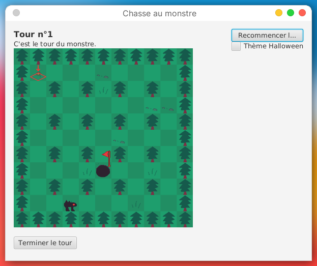

# Saé "chasse au monstre"

Groupe H1 (S3-H):

- TOURNEUR Aymeri
- LECLERCQ Manon
- ECKMAN Nicolas
- BELGUEBLI Rayane
- GYSEMANS Thomas


### Description du projet :

Ce projet est un jeu _"chasse au monstre"_, c'est-à-dire qu'on a un monstre et un chasseur. L'objectif du monstre est de s'échapper en trouvant la sortie, et celle du chasseur est de trouver et tuer le monstre. 

Chaque tour, le monstre bouge et essaie de se frayer un chemin vers la sortie, et le chasseur tire sur la case où il pense que le monstre se trouve.




### Comment lancer le jeu :

Lancer App.java

### Fonctionnalités actuelles :

- Génération d'un labyrinthe généré à l'aide d'un algorithme. (Recursive Backtracing)
- Affichage de l'historique de déplacement du monstre pour le chasseur
- Placement du monstre/de la sortie aléatoirement
- Vue monstre/chasseur différente
- Condition de victoire monstre/chasseur
- Thèmes

### Fonctionnalités futures :

- Menu principal
- IA pour le monstre et le chasseur, pour pouvoir jouer en solo
- Possibilité de jouer sur 2 PC différents à l'IUT
- Règles du jeu personnalisables
- Créer un JAR pour lancer le jeu

### Fonctionnalités éventuelles :

- Brouillard pour le monstre au-delà de 2/3 de distance
- Mécaniques de gameplay et de jeu additionnelles

### Multijoueur :

À ce stade, un joueur peut héberger une partie sur sa machine locale, et un autre joueur du réseau de l'IUT (ou le même joueur mais via une instance différente du jeu) peut rejoindre la partie. Pour que la connexion se fasse, le joueur distant doit renseigner le nom de la machine hôte (exemple: acajou28).

Pour tester le multijoueur en local, il suffit de lancer deux fois le jeu: une instance sera l'hôte et l'autre sera le "client". Le nom de la machine peut ne pas être correctement affiché sur l'interface car elle n'est pas prévue à ce but.

Si vous avez besoin du nom de votre machine, deux solutions :

```bash
hostname
# commande dans le terminal, sous Linux
```

Le nom de l'hôte est également affiché dans la console de debug de l'instance hôte (via un `System.out.println()`).

> NOTE: en local, il est également possible d'utiliser `127.0.0.1` dans le champ de texte, lorsque l'on rejoint une partie.

### Jalon 1


|Personne|Travail|
|--------|-------|
|Rayane|Implémenté les méthodes du JAR|
|Aymeri|IHM|
|Thomas|Commentaires, javadoc, review du code|
|Manon|Tests|
|Nicolas|Devait aider pour le javafx mais soucis pour le faire marcher|


### Jalon 2

|Personne|Travail|
|--------|-------|
|Rayane|Ajout grenade pour chasseur, superjump pour monstre, refactoring|
|Aymeri|Clean code, peaufinage, brouillard de guerre, algorithme labyrinthe, paramétrage de la partie|
|Thomas|Lobby multijoueur (un joueur peut host une game et rejoindre une game)|
|Manon|IA du monstre, clean code|
|Nicolas|Menu en javaFX (UI), controllers|